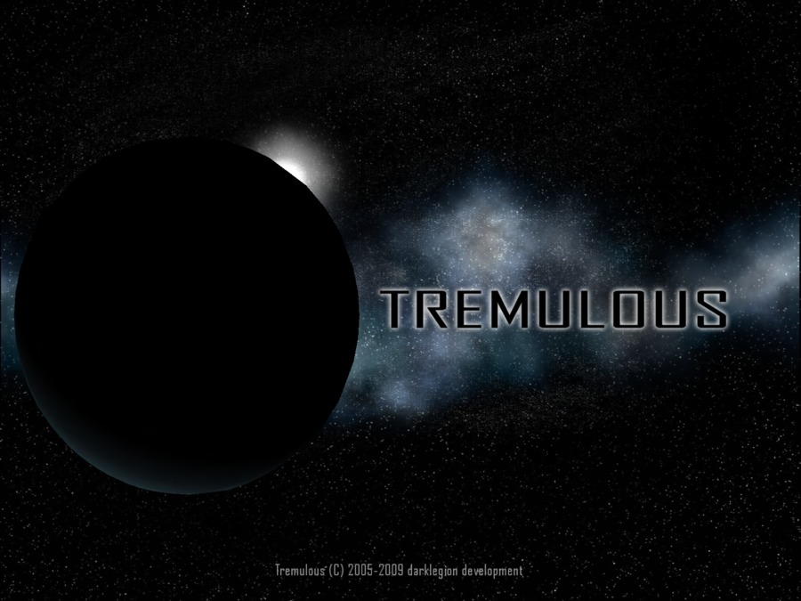

Tremulous Resources
-------------------

This is a ressource package for map ported from the [Tremulous](http://tremulous.net/) game by Darklegion Development to the [Unvanquished](https://www.unvanquished.net/) game.

Ported from Tremulous gpp packages from [http://ingar.satgnu.net/files/tremulous/base/](http://ingar.satgnu.net/files/tremulous/base/) and Tremulous 1.1.0 files from [http://tremulous.net](http://tremulous.net).

This port is an Interstellar Oasis initiative: [https://github.com/interstellar-oasis/interstellar-oasis](https://github.com/interstellar-oasis/interstellar-oasis).

Illustration
------------



How-to
------

* Get the source

```
git clone https://github.com/interstellar-oasis/res-tremulous.git res-tremulous_source.pk3dir
cd res-tremulous_source.pk3dir/
```

* Build

You need the [grtoolbox](https://github.com/illwieckz/grtoolbox).  
You will find the pk3dir in `build/test`.

```
make
```

* Package

You will find the pk3 in `build/pkg`.

```
make pk3
```

Maps
----

The maps are not stored in this repository, but this repository provides assets for them:

* _[Arachnid 2](https://github.com/interstellar-oasis/map-arachnid2)_ by Robin “OverFlow” Marshall
* _[Advanced Tremulous Combat Simulator](https://github.com/interstellar-oasis/map-atcshd)_ by Nicolas “jex” Jansens, Superpie and Stijn “Ingar“ Buys
* _[Karith Station 2](https://github.com/interstellar-oasis/map-karith)_ by Gordon “Godmil” Miller
* _[Nexus Corp. Infusion Plant 6](https://github.com/interstellar-oasis/map-nexus)_ by Nicolas “jex” Jansens
* _[Niveus: Outpost 652](https://github.com/interstellar-oasis/map-niveus)_ by Nicolas “jex” Jansens
* _[Transit Station](https://github.com/interstellar-oasis/map-transit)_ by Jan “Stannum” Van der Weg
* _[Tremor](https://github.com/interstellar-oasis/map-termor)_ by Mike “Vedacon” Mcinnerney and Gordon “Godmil” Miller
* _[Uncreation](https://github.com/interstellar-oasis/map-uncreation)_ by Who-[Soup]

Credits
-------

This the credit list for this ressource package, not for the Tremulous game itself, this is why Tremulous developers are referenced in the thanks.

Unvanquished port:

* Thomas “illwieckz” Debesse <dev@illwieckz.net> (http://gg.illwieckz.net)

Textures & Shaders:

* Nicolas “Jex“ Jansens <jex@orodu.net>
* Gordon “Godmil” Miller <godmil@gmail.com> (http://godmil.com/)
* Randy “ydnar” Redding <ydnar@shaderlab.com> (http://www.shaderlab.com)
* Jan “Stannum” Van der Weg (http://janvanderweg.com/)
* Matthew “Lunaran” Breit (http://lunaran.com/)
* Paul “MoP” Greveson (http://www.predictable-paul.com/)
* Robin “OverFlow” Marshall (http://bobbin.vilkacis.net)
* Simon “sock” O'Callaghan (http://www.simonoc.com/)
* Yves “evil lair” Allaire (http://evillair.net)
* Chris “Amethyst” Matz
* Louie “KnightBK“ Doulias
* Mike “Vedacon” McInnerney
* The nice chap who released his "ds-old-tex" set to the public

Sound effects:

* Tim “Timbo” Angus <tim@ngus.net>
* Chris “Dolby” McCarthy

Models:

* Jan “Stannum” Van der Weg
* Mike “Vedacon” McInnerney

Special thanks:

* Stijn “Ingar“ Buys <ingar@osirion.org> (http://ingar.satgnu.net/)
* Chris “Lakitu7” Schwarz <lakitu7@gmail.com>
* Ben “benmachine” Millwood (http://benmachine.co.uk/)
* Ben “DASPRiD” Scholzen (http://www.dasprids.de/)
* Asa “Norfenstein” Kravets
* Dan “kharnov” Floda
* John “Rezyn” Ellis
* M. “Undeference” Kristall
* Tony “tjw“ White
* Tristan “Jhrx“ Blease
* cu-kai
* Khalsa
* Catalyc
* Crimity
* Kat
* Lava Croft
* Lifer
* Molog
* Myth
* ravyn
* StalKermit
* Roughrider
* The MaF clan

Legal
-----

Changes by Thomas Debesse fall under the Internet Systems Consortium License:  
http://directory.fsf.org/wiki/License:ISC

Assets by Tremulous contributors fall under the Creative Commons Attribution-ShareAlike 2.5 Generic License:  
http://creativecommons.org/licenses/by-sa/2.5/

Textures by Yves Allaire fall under the Creative Commons Attribution-ShareAlike 4.0 International License:  
http://creativecommons.org/licenses/by-sa/4.0/

Textures by Chris Matz fall under the GNU General Public License version 2:  
http://www.gnu.org/licenses/old-licenses/gpl-2.0.en.html

Textures from shaderlab are subject to the terms of this notice:  
Usage and redistribution policy: Textures may be freely downloaded, modified, and used in free maps, mods or total conversions provided this copyright notice is left intact and a link to Shaderlab is provided in the credits or read-me file. Other non-commercial applications are considered on a case-by-case basis via e-mail. All other usage requires written permission. Bulk redistribution or archival of the textures in any medium, digital or otherwise (except mapping packages for mods) is prohibited.

Textures from Matthew Breit are subject to the terms of this notice:  
You may: Use the included custom textures & shaders, or modifications thereof, provided you give note of such in an attached readme (and please let me know). Distribute this pak file and/or its contents by any electronic means, provided you leave the contents unaltered and include this text file, also unaltered. You may not: Commercially exploit this file or its contents in any way. Distribute this pak file and/or its contents on any hard media whatsoever, including but not limited to magazine coverdisks or level compilations, without prior consent of and negotiation with the author.

History
-------

* 2015-08-16:	Tremulous Resources 1.2 (Unvanquished community resource pack)
* 2009-12-04:	Tremulous 1.2 Beta (Gameplay preview)
* 2006-03-31:	Tremulous 1.1.0 (Standalone)
* 2005-10-09:	Tremulous 1.0.2 (Quake Ⅲ Arena modification)
* 2005-09-08:	Tremulous 1.0.1 (Quake Ⅲ Arena modification)
